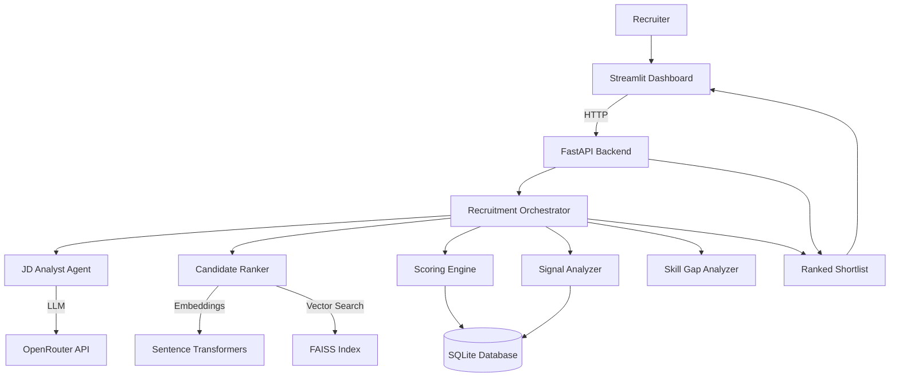
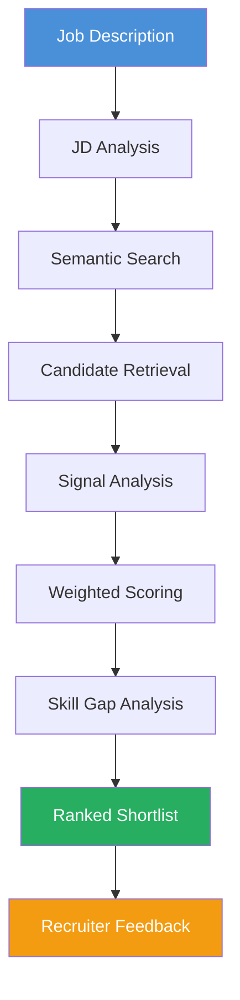
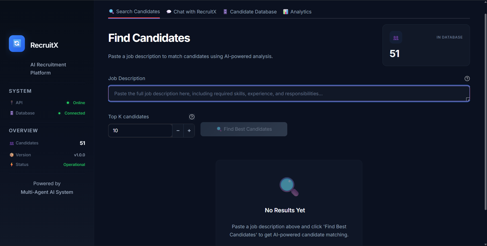
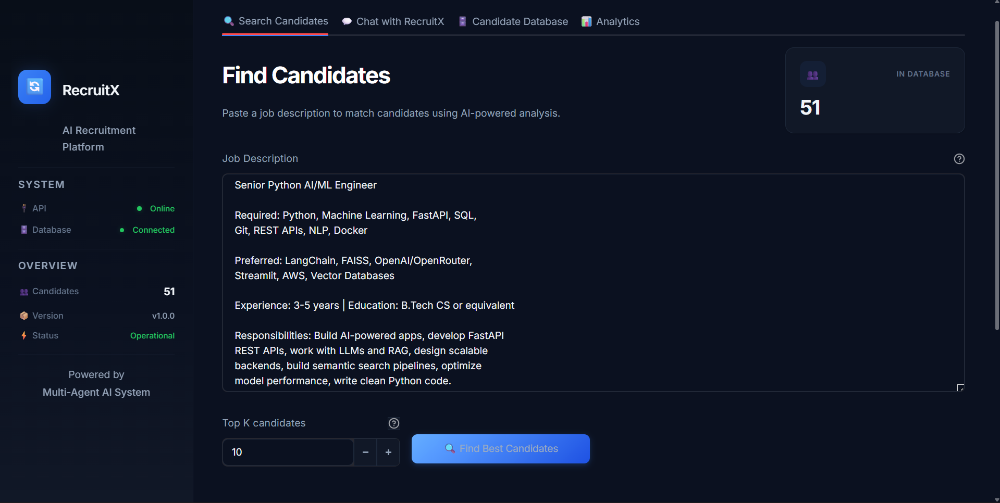
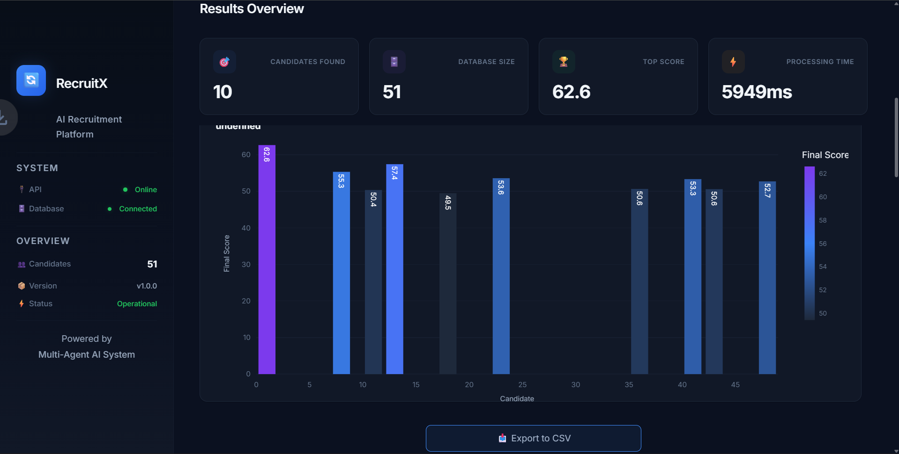
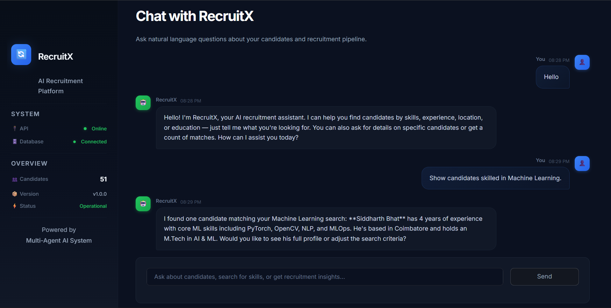
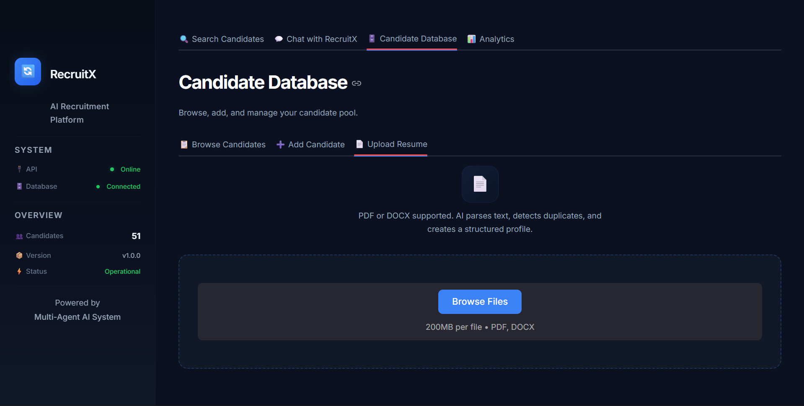
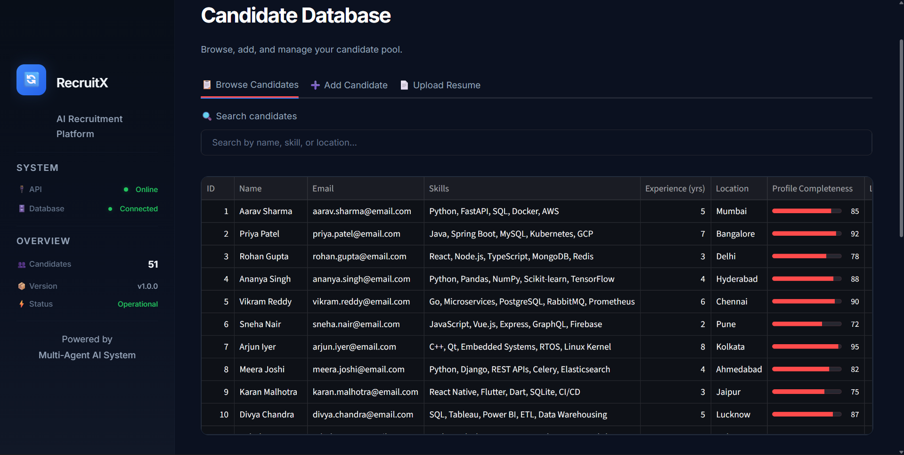
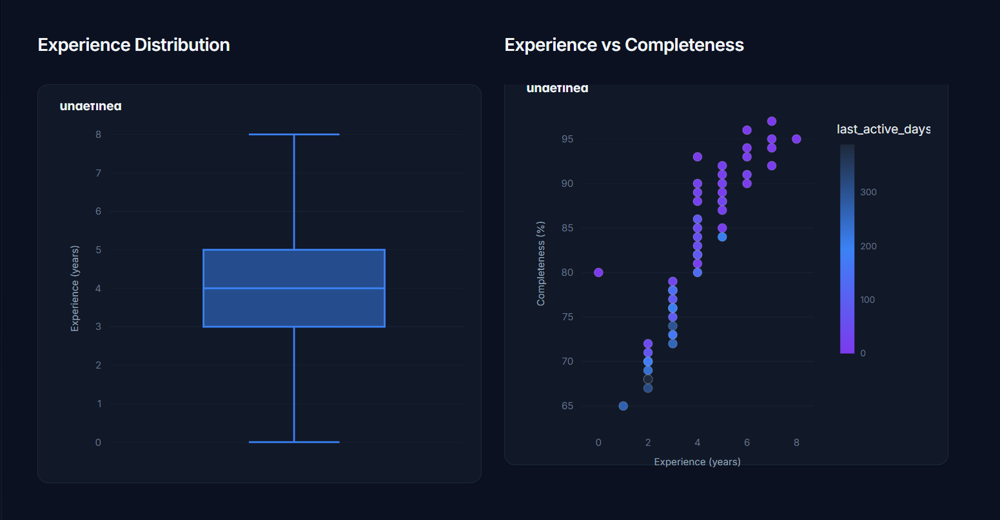

<div align="center">

# RecruitX

**Autonomous Multi-Agent AI Recruitment System**

From raw job description to ranked shortlist — powered by LLM agents, semantic vector search, and explainable scoring.

[](https://www.python.org/)
[](https://fastapi.tiangolo.com/)
[](https://streamlit.io/)
[](https://www.docker.com/)
[](https://github.com/facebookresearch/faiss)
[](https://www.sbert.net/)
[](https://openrouter.ai/)
[](https://www.sqlite.org/)
[](LICENSE)

</div>

---

## Project Status

> **Status:** Actively developed | **Last updated:** July 2026 | **194 tests passing** | **Python 3.12**

---

## Table of Contents

- [Project Overview](#project-overview)
- [Motivation](#motivation)
- [Key Features](#key-features)
- [Technology Stack](#technology-stack)
- [System Architecture](#system-architecture)
- [Recruitment Pipeline](#recruitment-pipeline)
- [Folder Structure](#folder-structure)
- [Installation](#installation)
- [Running with Docker](#running-with-docker)
- [API Documentation](#api-documentation)
- [Screenshots](#screenshots)
- [Project Highlights](#project-highlights)
- [Engineering Challenges](#engineering-challenges)
- [Future Improvements](#future-improvements)
- [Author](#author)
- [License](#license)

---

## Project Overview

RecruitX is an autonomous recruitment system that automates candidate screening. Submit a job description — the system analyzes requirements, searches candidates by semantic meaning, scores each profile, and returns a ranked shortlist with transparent score breakdowns.

**What makes it different:** Traditional applicant tracking systems rely on keyword matching. RecruitX uses semantic vector search (FAISS + Sentence Transformers) to understand meaning — a "full-stack developer experienced with REST APIs" matches a Python backend role even when keywords don't overlap.

**Architecture:** Five specialized agents coordinate through a central pipeline — JD Analyst (LLM extraction), Candidate Ranker (FAISS search), Signal Analyzer (rule-based scoring), Chat Agent (LLM + keyword fallback), and Orchestrator (pipeline coordination).

---

## Motivation

Screening resumes manually is slow, inconsistent, and error-prone. RecruitX was built to solve three core problems:

| Problem | How RecruitX Solves It |
|---------|----------------------|
| **Manual resume screening** | Automated pipeline processes job descriptions and ranks candidates in seconds |
| **Poor keyword matching** | Semantic vector search understands meaning and context, not just exact terms |
| **Time-consuming evaluation** | Weighted scoring formula combines skill fit, semantic match, and behavioral signals into a single explainable score |

The result: recruiters spend less time filtering and more time evaluating the right candidates.

---

## Key Features

| Feature | Description |
|---------|-------------|
| **AI Job Description Analysis** | LLM extracts required skills, preferred skills, experience, and education from raw JD text |
| **Semantic Candidate Search** | Sentence Transformer embeddings + FAISS vector similarity for meaning-based candidate matching |
| **Resume Parsing** | Upload PDF/DOCX resumes; auto-extract, deduplicate, and index candidates |
| **Candidate Ranking** | Weighted scoring (Semantic 50% + Skill 30% + Signal 20%) with per-candidate breakdowns |
| **Skill Gap Analysis** | Identifies matched, missing, and bonus skills per candidate against job requirements |
| **Recruiter Feedback Loop** | Thumbs-up/thumbs-down feedback stored for future ranking improvements |
| **AI Recruiter Chat** | Natural language interface for queries like "Python devs in Bangalore with 3+ years" |
| **Interview Question Generation** | LLM-generated questions targeting each candidate's specific skill gaps |
| **FastAPI REST APIs** | 10 RESTful endpoints with auto-generated OpenAPI documentation |
| **Streamlit Dashboard** | Interactive 4-tab UI: Find Candidates, Chat, Database, Analytics |
| **Docker Support** | Multi-stage Docker build for consistent deployment anywhere |

---

## Technology Stack

| Category | Technology | Purpose |
|----------|-----------|---------|
| **Language** | Python 3.12 | Core runtime |
| **Backend** | FastAPI + Uvicorn | REST API with auto-generated OpenAPI docs |
| **Frontend** | Streamlit | Python-native recruiter dashboard |
| **AI / LLM** | OpenRouter (Mistral 7B) | JD analysis, resume parsing, chat, question generation |
| **LLM Framework** | LangChain | Prompt chaining and agent orchestration |
| **Embeddings** | Sentence Transformers (`all-MiniLM-L6-v2`) | Local 384-dim text-to-vector encoding |
| **Vector Database** | FAISS-CPU (IndexFlatIP) | Cosine-similarity candidate retrieval |
| **Database** | SQLite | Zero-configuration persistent storage |
| **Resume Parsing** | pypdf, python-docx | PDF and DOCX text extraction |
| **Data Processing** | pandas, numpy | Candidate data manipulation |
| **Visualization** | Plotly | Interactive score charts and analytics |
| **Containerization** | Docker (multi-stage) | Consistent build and deployment |

---

## System Architecture



### Agent Responsibilities

| Agent | Module | Method | Responsibility |
|-------|--------|--------|---------------|
| **JD Analyst** | `agents/jd_analyst.py` | LLM (OpenRouter) | Extracts required/preferred skills, experience, education, seniority from raw JD text |
| **Candidate Ranker** | `agents/candidate_ranker.py` | FAISS vector search | Retrieves top-N candidates by semantic similarity to JD |
| **Signal Analyzer** | `agents/signal_analyzer.py` | Rule-based algorithm | Scores profile completeness, recency, and experience fit |
| **Chat Agent** | `agents/chat_agent.py` | LLM + keyword fallback | Processes natural language recruiter queries |
| **Orchestrator** | `agents/orchestrator.py` | Coordination | Runs the full pipeline: analyze → search → score → rank → persist |

---

## Recruitment Pipeline



**Scoring Formula:**

```
Final Score = (Semantic × 0.50) + (Skill × 0.30) + (Signal × 0.20)
```

| Component | Weight | Calculation |
|-----------|--------|-------------|
| **Semantic Score** | 50% | FAISS inner-product similarity on L2-normalized embeddings, normalized to [0, 100] |
| **Skill Score** | 30% | (Required skills match × 0.70) + (Preferred skills match × 0.30) |
| **Signal Score** | 20% | (Profile completeness × 0.40) + (Recency × 0.40) + (Experience match × 0.20) |

---

## Folder Structure

```
RecruitX/
├── agents/                    # AI agents (business logic)
│   ├── orchestrator.py        #   Pipeline coordinator
│   ├── jd_analyst.py          #   JD analysis via LLM
│   ├── candidate_ranker.py    #   FAISS semantic search
│   ├── signal_analyzer.py     #   Behavioral signal scoring
│   └── chat_agent.py          #   Natural language chat interface
├── api/                       # FastAPI backend
│   ├── main.py                #   App entry point + middleware
│   ├── models.py              #   Pydantic request/response schemas
│   └── routes/                #   API route modules
│       ├── recruitment.py     #     POST /api/recruit, /api/feedback
│       ├── candidates.py      #     CRUD /api/candidates
│       ├── resumes.py         #     POST /api/upload-resume
│       ├── chat.py            #     POST /api/chat
│       └── interviews.py      #     POST /api/interview-questions
├── database/                  # SQLite data layer
│   ├── models.py              #   Table definitions + indexes
│   ├── db_setup.py            #   DB initialization + sample data
│   └── crud.py                #   All CRUD operations
├── embeddings/                # Vector search layer
│   ├── embedder.py            #   SentenceTransformer encoding
│   ├── vector_store.py        #   FAISS index management
│   └── build_index.py         #   Index builder script
├── scoring/                   # Scoring and analysis
│   ├── scoring_engine.py      #   Weighted scoring formula
│   └── skill_gap.py           #   Skill gap classification
├── utils/                     # Utilities
│   ├── resume_parser.py       #   PDF/DOCX extraction + LLM parsing
│   ├── interview_generator.py #   LLM-based question generation
│   ├── llm_utils.py           #   Shared LLM helper functions
│   └── memory.py              #   Memory usage monitoring
├── scripts/                   # CLI maintenance scripts
│   ├── build_index.py         #   Rebuild FAISS index
│   └── validate_candidates.py #   Validate sample data
├── frontend/                  # Streamlit dashboard
│   └── dashboard.py           #   Full recruiter UI (4 tabs)
├── tests/                     # pytest suite (12 test files)
│   ├── conftest.py            #   Shared fixtures
│   ├── test_api.py            #   API endpoint tests
│   ├── test_orchestrator.py   #   Pipeline integration tests
│   ├── test_scoring.py        #   Scoring engine tests
│   └── ... (12 test files)
├── data/                      # Data files
│   ├── sample_candidates.csv  #   50 Indian candidate profiles
│   ├── sample_jds/            #   3 sample job descriptions
│   ├── recruitx.db            #   SQLite database (auto-generated)
│   ├── faiss_index.bin        #   FAISS vector index (auto-generated)
│   └── faiss_id_map.pkl       #   FAISS ID mapping (auto-generated)
├── screenshots/               # UI screenshots
├── uploads/                   # Uploaded resume files (UUID-named)
├── docs/                      # Documentation
│   ├── API_REFERENCE.md       #   REST API reference
│   ├── ARCHITECTURE.md        #   System architecture
│   └── PROJECT_STRUCTURE.md   #   Project organization guide
├── config.py                  # Centralized configuration
├── Dockerfile                 # Multi-stage Docker build
├── render.yaml                # Render deployment blueprint
├── requirements.txt           # Python dependencies
├── INSTALL.md                 # Installation guide
└── LICENSE                    # MIT License
```

---

## Installation

### Prerequisites

- **Python 3.12+**
- **Git**
- **OpenRouter API Key** — Sign up at [openrouter.ai](https://openrouter.ai)
- **4 GB RAM** minimum (8 GB recommended)

### Quick Start

```bash
# Clone the repository
git clone https://github.com/princitripathi/RecruitX.git
cd RecruitX

# Create and activate virtual environment
python -m venv venv
# Windows:
venv\Scripts\activate
# macOS / Linux:
source venv/bin/activate

# Install dependencies
pip install -r requirements.txt

# Configure environment variables
cp .env.example .env
# Edit .env and set OPENROUTER_API_KEY

# Initialize database with 50 sample candidates
python database/db_setup.py

# Build FAISS vector index
python scripts/build_index.py

# Start the API server (port 8000)
uvicorn api.main:app --reload --port 8000

# In a separate terminal, start the dashboard (port 8501)
streamlit run frontend/dashboard.py
```

### Access Points

| Service | URL |
|---------|-----|
| Dashboard | `http://localhost:8501` |
| API Docs (Swagger) | `http://localhost:8000/docs` |
| API Docs (ReDoc) | `http://localhost:8000/redoc` |
| Health Check | `http://localhost:8000/api/health` |

---

## Running with Docker

RecruitX includes a multi-stage Dockerfile for optimized builds.

### Build and Run

```bash
# Build the Docker image
docker build -t recruitx .

# Run the container
docker run -d \
  -p 8000:8000 \
  -e OPENROUTER_API_KEY=your_api_key_here \
  --name recruitx \
  recruitx
```

### Ports

| Port | Service |
|------|---------|
| `8000` | FastAPI backend (API + auto-generated docs) |

### What Docker Handles

- Multi-stage build (builder + runtime) for smaller image size
- Python 3.12-slim base image
- Dependencies installed in virtual environment
- Database initialized at build time with 50 sample candidates
- Application served via Uvicorn on port 8000

> **Note:** The Streamlit dashboard runs separately. For full-stack Docker deployment, extend with a docker-compose setup.

---

## Deployment Note

RecruitX is fully functional in a local development environment.

Cloud deployment of the AI inference pipeline may require additional compute resources depending on the selected embedding model.

---

## API Documentation

> **Complete API reference:** [docs/API_REFERENCE.md](./docs/API_REFERENCE.md)

### Endpoints

| Method | Endpoint | Purpose | Request Body | Response |
|--------|----------|---------|-------------|----------|
| `GET` | `/api/health` | Server health check | — | `{status, app, version}` |
| `POST` | `/api/recruit` | Run recruitment pipeline | `{job_description, top_k?}` | `{shortlist, processing_time_ms}` |
| `GET` | `/api/candidates` | List all candidates | — | `{candidates: [...]}` |
| `POST` | `/api/candidates` | Add a new candidate | `{name, email, skills, ...}` | `{candidate, message}` |
| `GET` | `/api/candidates/{id}` | Get candidate by ID | — | `{candidate}` |
| `DELETE` | `/api/candidates/{id}` | Delete a candidate | — | `{message}` |
| `POST` | `/api/upload-resume` | Upload PDF/DOCX resume | `multipart/form-data` (file) | `{candidate, message, is_new}` |
| `POST` | `/api/chat` | Natural language query | `{message, session_id?}` | `{response, candidates, intent}` |
| `POST` | `/api/feedback` | Submit ranking feedback | `{shortlist_id, feedback}` | `{message}` |
| `POST` | `/api/interview-questions` | Generate interview questions | `{candidate_info, job_description, skill_gap}` | `{questions: [...]}` |

### Example: Run Recruitment Pipeline

```bash
curl -X POST http://localhost:8000/api/recruit \
  -H "Content-Type: application/json" \
  -d '{
    "job_description": "We are looking for a Python backend engineer with FastAPI and PostgreSQL experience.",
    "top_k": 5
  }'
```

Response includes a sorted shortlist with each candidate's semantic, skill, and signal scores plus a human-readable explanation.

---

## Screenshots

| Dashboard | Candidate Search |
|-----------|-----------------|
|  |  |
| *Main dashboard with analytics overview* | *Semantic search with keyword filtering* |

| Ranking Results | Chat Interface |
|----------------|----------------|
|  |  |
| *Score breakdowns and ranking table* | *Natural language recruiter chat* |

| Resume Upload | Database View |
|--------------|---------------|
|  |  |
| *Upload and parse PDF/DOCX resumes* | *Candidate database with search* |

| Analytics |
|-----------|
|  |
| *Interactive score distribution charts* |

> **Note:** Screenshots are from the live application running locally.

---

## Project Highlights

**Why these technology choices:**

| Decision | Rationale |
|----------|-----------|
| **FastAPI** | High-performance async Python framework with automatic OpenAPI documentation. Ideal for building REST APIs quickly with type safety. |
| **FAISS** | Facebook's library for efficient similarity search. Enables sub-second semantic search over candidate embeddings without external database dependencies. |
| **Sentence Transformers** | Produces high-quality 384-dim embeddings locally (no API calls) for meaning-based text comparison. |
| **OpenRouter** | Unified API for accessing multiple LLMs. Used for JD analysis, resume parsing, chat, and question generation. |
| **Modular Agent Architecture** | Five specialized agents with single responsibilities. Easy to test, extend, and replace individual components. |
| **SQLite** | Zero-configuration database perfect for a self-contained project. No external database server required. |
| **Docker** | Multi-stage build ensures reproducible deployments. Builder stage caches dependencies for faster rebuilds. |
| **Streamlit** | Python-native UI framework. No frontend build step — the entire dashboard is a single Python file. |

**Engineering practices demonstrated:**

- **Comprehensive test suite** covering unit and integration tests
- **Layered architecture** with clear separation of concerns
- **Dependency injection** for testable agent design
- **Lazy loading** of AI models to minimize startup time
- **MD5 deduplication** for resume uploads
- **Explainable scoring** with per-component breakdowns

---

## Engineering Challenges

| Challenge | Solution |
|-----------|----------|
| **Semantic vs keyword search** | FAISS + Sentence Transformers for meaning-based matching |
| **LLM output parsing** | JSON extraction with regex fallback for malformed responses |
| **Resume deduplication** | MD5 hashing of normalized resume content |
| **Model loading latency** | Lazy loading of Sentence Transformer model at first query |
| **Zero external dependencies** | SQLite + FAISS — no Docker Compose or external DB services needed |

---

## Future Improvements

- [ ] **Resume Upload Portal** — Dedicated UI for bulk resume uploads with progress tracking
- [ ] **Authentication** — JWT-based recruiter accounts with role-based access
- [ ] **PostgreSQL Migration** — Production-grade database for multi-user deployments
- [ ] **Email Notifications** — Notify recruiters when new candidates match their JDs
- [ ] **Interview Scheduling** — Calendar integration for automated interview booking
- [ ] **Analytics Dashboard** — Hiring funnel metrics, time-to-hire trends, source effectiveness
- [ ] **Feedback Learning** — Weighted scoring adjustments based on recruiter feedback history

---

## Author

**Princi Tripathi** — B.Tech Computer Science

- [GitHub](https://github.com/princitripathi)
- [LinkedIn](https://www.linkedin.com/in/princi-tripathi)
- Email: [princitrp@gmail.com](mailto:princitrp@gmail.com)

---

## License

This project is licensed under the MIT License. See the [LICENSE](LICENSE) file for details.

---

<div align="center">

Built by **Princi Tripathi** — B.Tech Computer Science

[GitHub](https://github.com/princitripathi) · [LinkedIn](https://www.linkedin.com/in/princi-tripathi) · [Email](mailto:princitrp@gmail.com)

</div>
